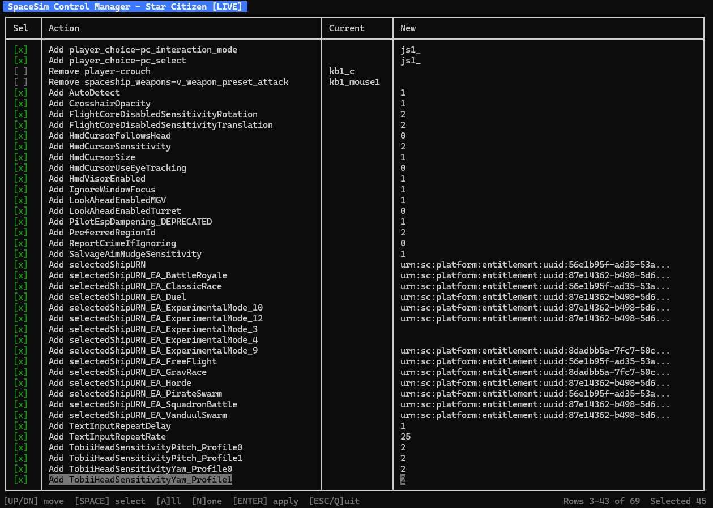

# Space Sim Control Manager

Utility to help players retain and migrate their control mappings for space-sim games, especially for new SC version releases. Elite Dangerous is also supported.

## Standard Usage (Star Citizen)

### Import

Reads the Star Citizen `actionmaps.xml` and `attributes.xml` files and stores the input device settings and mappings.

On the first import, when no saved mappings exist yet, everything is captured automatically:

```text
> SSCM.exe sc import
Read in 4 input devices.
Read in 114 mappings.
Read in 12 attributes.
Mappings saved to [My Documents\SSCM\SC\scmappings.json].
```

When saved mappings already exist, import opens a terminal UI so you can choose which changes to accept. See [Interactive import and export](#interactive-import-and-export) below.



### Edit

Opens the captured mappings file in the system default editor. Set the `Preserve` property to `true` to overwrite the game configuration when exporting.

```text
> SSCM.exe sc edit
Opening [My Documents\SSCM\SC\scmappings.json] in the default editor, change the Preserve property to choose which settings are overwritten.
```

### Export

Updates the Star Citizen game configuration from the locally saved mappings using a terminal UI. Only inputs, mappings, and attributes marked `Preserve: true` are considered.

When changes are available, a table lists each proposed update with its current and new values. Select the rows you want, then press Enter to apply them to `actionmaps.xml` and `attributes.xml`.

When no changes are necessary:

```text
> SSCM.exe sc export
CONFIGURATION NOT UPDATED: No changes necessary.
```

After applying changes through the terminal UI:

```text
MUST RESTART STAR CITIZEN FOR CHANGES TO TAKE EFFECT.
CONFIGURATION UPDATED: Changes applied to Star Citizen.
```

Use `sc export preview` or `sc export apply` instead when you want non-interactive text output. See [Advanced Usage](#advanced-usage).

### Upgrade

After a Star Citizen patch renames or removes actions, upgrades the saved mappings to match the current game defaults. Preview first, then apply.

```text
> SSCM.exe sc upgrade
RENAMING: spaceship_movement-v_ifcs_toggle_cruise_control to spaceship_movement-v_ifcs_throttle_swap_mode...
3 changes NOT saved! Run in apply mode to save changes.
```

```text
> SSCM.exe sc upgrade apply
RENAMING: spaceship_movement-v_ifcs_toggle_cruise_control to spaceship_movement-v_ifcs_throttle_swap_mode...
Mappings saved to [My Documents\SSCM\SC\scmappings.json].
```

### Report

Creates a plain-text report of the captured mappings (multiple formats available).

```text
> SSCM.exe sc report > starcitizen_mappings.md
```

```text
> SSCM.exe sc report -f csv > starcitizen_mappings.csv
```

```text
> SSCM.exe sc report -f json > starcitizen_mappings.json
```

## Advanced Usage

### Star Citizen environment

Commands target the `LIVE` environment by default. Use `--environment` or `-e` to target another Star Citizen environment, such as `PTU` or `HOTFIX`.

```text
> SSCM.exe sc --environment PTU import preview
```

### Importing when there is already saved mappings

Use `import preview` to list differences as plain text without saving anything:

```text
> SSCM.exe sc import preview
MAPPING changed and will merge: [seat_general-v_toggle_mining_mode] js2_button55 => js2_button54
MAPPING changed and will not merge: [seat_general-v_toggle_quantum_mode] => js2_button56, preserving js2_button19
MAPPING changed and will not merge: [seat_general-v_toggle_scan_mode] => js2_button55, preserving js2_button54
1 changes NOT saved! Run in merge or overwrite modes to save changes.
```

The default `sc import` command opens the terminal UI instead. Use `sc import tui` to open it explicitly.

#### Merge mappings

Merges the latest changes for the non-preserved mappings.

```text
> SSCM.exe sc import merge
MAPPING changed and will merge: [seat_general-v_toggle_mining_mode] js2_button55 => js2_button54
MAPPING changed and will not merge: [seat_general-v_toggle_quantum_mode] => js2_button56, preserving js2_button19
MAPPING changed and will not merge: [seat_general-v_toggle_scan_mode] => js2_button55, preserving js2_button54
Mappings saved to [My Documents\SSCM\SC\scmappings.json].
```

#### Overwrite mappings

Overwrite all the captured mappings with the latest changes.

```text
> SSCM.exe sc import overwrite
Read in 4 input devices.
Read in 114 mappings.
Read in 12 attributes.
[WARN ] Overwriting existing mappings data!
Mappings saved to [My Documents\SSCM\SC\scmappings.json].
```

#### Serial import

Prompts for each change one at a time instead of using the terminal UI table.

```text
> SSCM.exe sc import serial
```

### Export preview and apply

Previews or applies all preserved changes without the terminal UI.

```text
> SSCM.exe sc export preview
PREVIEWING EXPORT:
UPDATING: seat_general-v_toggle_mining_mode from js2_button55 to js2_button56...
UPDATING: seat_general-v_toggle_quantum_mode from js2_button56 to js2_button19...
UPDATING: seat_general-v_toggle_scan_mode from js2_button55 to js2_button54...
CONFIGURATION NOT UPDATED: Execute "export apply" to apply these changes.
```

```text
> SSCM.exe sc export apply
UPDATING: seat_general-v_toggle_mining_mode from js2_button55 to js2_button56...
UPDATING: seat_general-v_toggle_quantum_mode from js2_button56 to js2_button19...
UPDATING: seat_general-v_toggle_scan_mode from js2_button55 to js2_button54...
SAVING: updated actionmaps.xml...
SAVING: updated attributes.xml...
Saved, run "restore" command to revert.
MUST RESTART STAR CITIZEN FOR CHANGES TO TAKE EFFECT.
CONFIGURATION UPDATED: Changes applied to Star Citizen.
```

Use `--matches` (or `-m`) to only export settings that already exist in the game configuration:

```text
> SSCM.exe sc export preview --matches
```

Use `sc export serial` to confirm each change individually, or `sc export tui` to open the terminal UI explicitly.

### Interactive import and export

Both `sc import` and `sc export` use the same terminal UI when interactive selection is needed.

| Key | Action |
| --- | --- |
| Up / Down | Move cursor |
| Space | Toggle row selection |
| A | Select all rows |
| N | Clear selection |
| Enter | Apply selected changes |
| Esc / Q | Cancel without saving |

### Back up the Star Citizen configuration

Makes local copies of the Star Citizen `actionmaps.xml` and `attributes.xml` files, which can be restored later.

```text
> SSCM.exe sc backup
Star Citizen config backed up to [My Documents\SSCM\SC\actionmaps.xml.20221223022032.bak,My Documents\SSCM\SC\attributes.xml.20221223022032.bak].
```

### Restore the backed-up Star Citizen configuration

Restores the latest local backups of the Star Citizen `actionmaps.xml` and `attributes.xml` files.

```text
> SSCM.exe sc restore
Star Citizen config restored from [My Documents\SSCM\SC\actionmaps.xml.20221223022032.bak,My Documents\SSCM\SC\attributes.xml.20221223022032.bak].
```

### Edit the Star Citizen actionmaps.xml

Opens the Star Citizen game configuration in the system default editor.

```text
> SSCM.exe sc editgame
Opening [C:\Program Files\Roberts Space Industries\StarCitizen\LIVE\USER\Client\0\Profiles\default\actionmaps.xml] in the default editor.
```

`opengame` is an alias for `editgame`.
